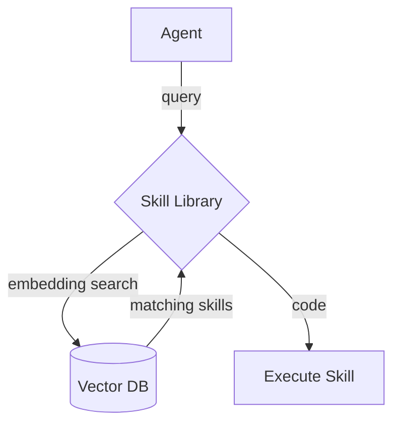
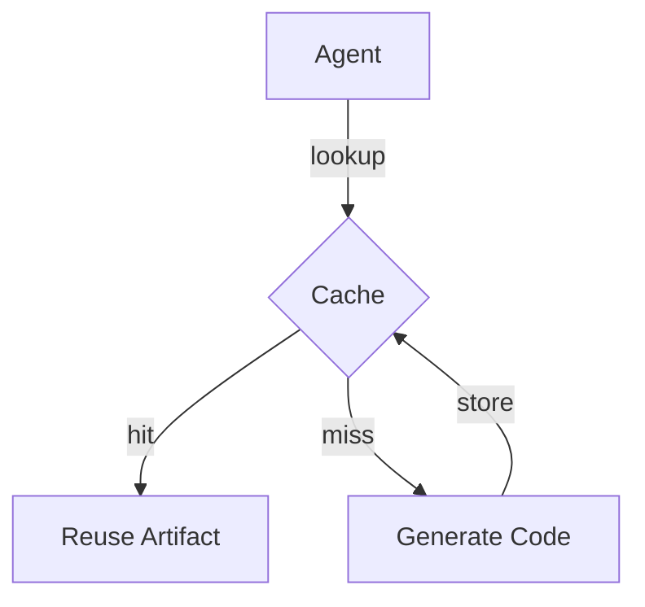

# Agents

## ArchaeologistAgent

`ArchaeologistAgent` is an event‑driven diagnostic helper that assists plugin
authors in understanding runtime failures. The agent listens for
`ISSUE_DETECTED` events on Auto‑GPT's event bus. When triggered it performs a
series of git and dependency checks and finally publishes a
`DIAGNOSIS_COMPLETE` event summarising its findings.

### Workflow

1. **Subscribe** – On initialisation the agent subscribes to
   `ISSUE_DETECTED` events on the shared `MessageQueue`.
2. **Collect context** – When an event is received the agent extracts metadata
   such as the affected file, line number and commit hash from the payload or
   the provided error log.
3. **Analyse the repository** – The agent may temporarily check out the
   referenced commit, run `git blame` on the file and scan the file for import
   statements to gather dependency information.
4. **Generate recommendations** – The results are condensed into a summary and
   simple actionable advice.
5. **Publish results** – A `DIAGNOSIS_COMPLETE` event is emitted so other
   components can surface the diagnostics to users or additional tools.

### Event bus and tool requirements

```python
from autogpt.event_bus import EventMessage, MessageQueue
from autogpt.agents import Archaeologist, ISSUE_DETECTED

message_queue = MessageQueue()
archaeologist = Archaeologist(message_queue)
```

To receive the agent's output, subscribe to `DIAGNOSIS_COMPLETE` events:

```python
from autogpt.event_bus import DIAGNOSIS_COMPLETE

message_queue.subscribe(DIAGNOSIS_COMPLETE, handle_diagnostics)
```

The agent requires the following tools to operate:

- **Git** – used for `git checkout` and `git blame` operations.
- **Python's `requests` package`** – used to fetch dependency release notes
  from PyPI.
- **Network access** – needed to retrieve package information.

Ensure these dependencies are installed and accessible to the runtime
environment where the agent executes.

### Example flow

A plugin encounters an exception and publishes an `ISSUE_DETECTED` event:

```python
message_queue.publish(
    EventMessage(
        ISSUE_DETECTED,
        payload={
            "plugin": "example-plugin",
            "error_log": 'File "example.py", line 10, in <module>\nImportError',
        },
    )
)
```

`ArchaeologistAgent` receives the event, extracts the file and line number from
`error_log`, runs `git blame` and inspects the file's imports. It then emits a
`DIAGNOSIS_COMPLETE` event containing a summary and recommendations:

```text
Diagnostics for plugin example-plugin at example.py:10
Investigate compatibility issues in: some_dependency
```

Other components subscribed to `DIAGNOSIS_COMPLETE` can display the message to
users or log it for further analysis.

## TDDDeveloperAgent

`TDDDeveloperAgent` automates test‑driven fixes. After diagnostics are
available it creates a regression test, guides the user toward a solution and
signals when a candidate fix is ready.

### Workflow

1. **Subscribe** – The agent listens for `DIAGNOSIS_COMPLETE` events on the
   shared `MessageQueue`.
2. **Prepare branch** – It creates a working branch using
   `git_create_branch` and checks it out.
3. **Create regression test** – A failing test file is generated with
   `create_test_file` using the supplied diagnostics.
4. **Run tests** – It executes `run_tests` on the new file to confirm the
   failure and again on the repository once the user applies a fix.
5. **Commit and publish** – When the test suite passes, the agent commits the
   changes and emits a `CODE_FIX_PROPOSED` event summarising the branch and
   commit hash.

### Event bus and configuration

```python
from autogpt.agents import TDDDeveloper
from autogpt.event_bus import DIAGNOSIS_COMPLETE, MessageQueue

message_queue = MessageQueue()
tdd = TDDDeveloper(agent, message_queue)
```

Ensure the runtime has access to Git and a working test runner. The commands
`git_create_branch`, `create_test_file` and `run_tests` must be available in the
agent's command registry.

### Example flow

The archaeology step has produced diagnostics and published a
`DIAGNOSIS_COMPLETE` event:

```python
message_queue.publish(
    EventMessage(
        DIAGNOSIS_COMPLETE,
        payload={
            "issue_id": "123",
            "repo_path": "/path/to/repo",
            "diagnostics": "stack trace",
        },
    )
)
```

`TDDDeveloperAgent` responds automatically:

```python
git_create_branch("/path/to/repo", "fix/123", agent)
create_test_file("/path/to/repo/tests/test_issue_123.py", "...", agent)
run_tests("/path/to/repo/tests/test_issue_123.py", agent)  # -> '1 failed'
# user implements fix
run_tests("/path/to/repo", agent)  # -> '1 passed'
```

When the tests succeed the agent commits the changes and broadcasts
`CODE_FIX_PROPOSED` so other components can review the fix.

## QAAgent

`QAAgent` validates proposed fixes and coordinates their integration. It
manages the final review cycle by chaining
`CODE_FIX_PROPOSED` → `HUMAN_APPROVAL_REQUIRED` → `ISSUE_RESOLVED` events on
the shared message bus.

### Workflow

1. **Subscribe** – The agent listens for `CODE_FIX_PROPOSED` events.
2. **Verify** – It checks out the proposed branch and runs `run_tests` to
   ensure the regression is solved.
3. **Request approval** – If tests pass, `QAAgent` emits a
   `HUMAN_APPROVAL_REQUIRED` event to optionally pause for manual review.
4. **Merge and deploy** – Once approved, the agent merges the branch with
   `git_merge` and can invoke a deployment script before broadcasting
   `ISSUE_RESOLVED`.

### Event bus and command requirements

```python
from autogpt.agents import QAAgent, CODE_FIX_PROPOSED
from autogpt.event_bus import MessageQueue

message_queue = MessageQueue()
qa = QAAgent(message_queue)
```

The commands `run_tests` and `git_merge` must exist in the agent's registry so
it can verify changes and integrate them.

### Example flow

```python
# TDDDeveloperAgent publishes CODE_FIX_PROPOSED
message_queue.publish(EventMessage(CODE_FIX_PROPOSED, payload={"branch": "fix/123"}))

# QAAgent responds
run_tests("/path/to/repo", agent)  # -> 'all passed'
message_queue.publish(EventMessage(HUMAN_APPROVAL_REQUIRED, payload={"branch": "fix/123"}))
# optional human approval received
git_merge("/path/to/repo", "fix/123", "main", agent)
subprocess.run(["./deploy.sh", "fix/123"])
message_queue.publish(EventMessage(ISSUE_RESOLVED, payload={"branch": "fix/123"}))
```

The human approval step may be automated or skipped in trusted environments,
and invoking the deployment script is optional depending on the project's
release process.

## Skill Library

Auto-GPT agents maintain a **skill library** of reusable tool scripts. Each
skill is stored with an embedding that allows semantic search so an agent can
reuse existing code instead of creating a new implementation.



### Setup

The library indexes skills in a vector database. The default
`MemoryVectorDB` stores embeddings in memory, but you can plug in any backend
by implementing `VectorDBProvider`:

1. Install and configure your vector DB, e.g. `pip install chromadb` for
   Chroma or `pip install weaviate-client` for Weaviate.
2. Implement a subclass of `VectorDBProvider` that wraps the database's API.
3. Create the library with your provider:

```python
from autogpt.skills import SkillLibrary
from my_vectors import ChromaVectorDB

library = SkillLibrary(config, vector_db=ChromaVectorDB())
```

### Example usage

```python
from autogpt import skills

query = "parse CSV into JSON"
matches = skills.search(query)
if matches:
    run_tool(matches[0])
```

## Artifact Cache

Agents cache artifacts such as generated code to avoid repeating work. The
`CacheManager` stores artifacts on disk or in SQLite and can retrieve them by
task signature or semantic similarity.



### Setup

Choose a storage backend for artifacts:

```python
from pathlib import Path
from autogpt.cache import CacheManager, DiskCacheBackend, SQLiteCacheBackend

# JSON files on disk
cache = CacheManager(DiskCacheBackend(Path("data/cache")))

# or SQLite database
cache = CacheManager(SQLiteCacheBackend(Path("data/cache.db")))
```

### Example usage

```python
task = "format report"
arts = cache.lookup_by_similarity(task)
if arts:
    result = arts[0].content
else:
    result = generate_code(task)
    cache.store(task, "code", result, {})
```

Agents typically query the skill library first and then the cache before
creating new code, minimising duplicate effort and API usage.

