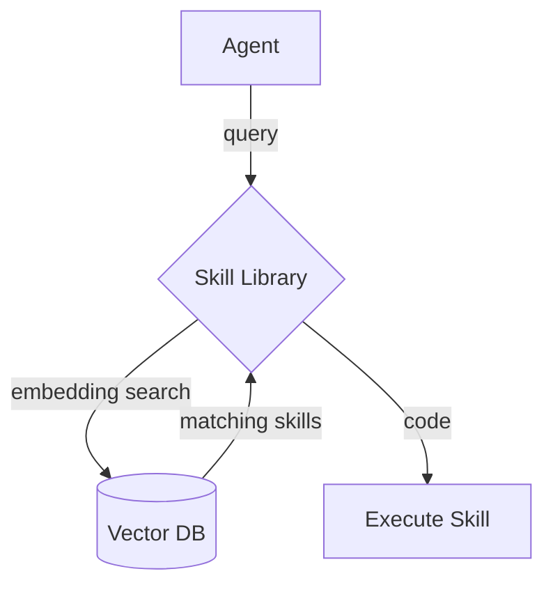
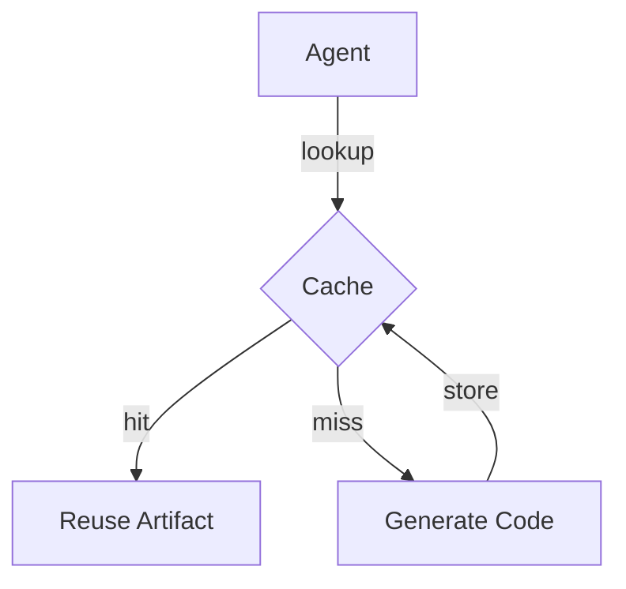

# Agents

## Master Orchestrator and Issue Lifecycle

Auto‑GPT ships with a lightweight orchestrator that coordinates the helper
agents over the shared event bus. It supervises the lifecycle of an issue from
detection to resolution:

1. **Detection** – A component emits `ISSUE_DETECTED` when a problem occurs. The
   payload **must** include an `issue_type` describing the nature of the problem,
   such as `"bug"` for runtime errors or `"dependency_update"` when a newer
   package version is available.
2. **Diagnosis** – `ArchaeologistAgent` analyses the repository and publishes
   `DIAGNOSIS_COMPLETE`.
3. **Development** – `TDDDeveloperAgent` creates a regression test, guides the
   fix and reports `CODE_FIX_PROPOSED`.
4. **Quality assurance** – `QAAgent` runs the test suite and requests manual
   review via `HUMAN_APPROVAL_REQUIRED`.
5. **Resolution** – After approval, the fix is merged and `ISSUE_RESOLVED`
   finalises the cycle.

The orchestrator ensures each agent is running and relays events between them,
providing a full end‑to‑end workflow for addressing issues.

## SentryAgent

`SentryAgent` acts as the system's watchman. It monitors plugins for failures
and surface anomalies by publishing `ISSUE_DETECTED` events:

- **Log monitoring** – Uses the `watchdog` library to tail log files under
  `plugins/*/logs/` and looks for patterns like `ERROR`, `Exception` or
  `Traceback`.
- **Health checks** – Polls each plugin's `/health` endpoint and records any
  non‑`200` responses.
- **Dependency updates** – Queries the GitHub API or PyPI for newer releases of
  declared dependencies and alerts when security updates are available.

When an anomaly is found the agent emits:

```python
EventMessage(
    ISSUE_DETECTED,
    payload={
        "plugin": "example",
        "error_log": "...",
        "issue_type": "bug",
    },
    source_agent="sentry",
)
```

The orchestrator spawns `SentryAgent` in its own thread and restarts it if it
crashes, ensuring continuous monitoring of plugin health.

## ArchaeologistAgent

`ArchaeologistAgent` is an event‑driven diagnostic helper that assists plugin
authors in understanding runtime failures. The agent listens for
`ISSUE_DETECTED` events on Auto‑GPT's event bus. The agent tailors its analysis
based on the event's `issue_type` and finally publishes a
`DIAGNOSIS_COMPLETE` event summarising its findings.

Expected `ISSUE_DETECTED` payload fields:

- `plugin` – identifier of the emitting component.
- `error_log` – log snippet or message describing the problem.
- `issue_type` – categorisation such as `"bug"` or `"dependency_update"`.
- Optional context like `file`, `line`, `commit` or `dependencies` may be
  supplied when available.

### Workflow

1. **Extract issue** – Parse event payloads to pull out metadata like file,
   line, commit hash and dependency information.
2. **Query librarian** – Build a search string from the issue details and call
   `LibrarianAgent.find_skill` followed by `LibrarianAgent.find_plugin` to
   surface reusable skills or related plugins.
3. **Branch on results** – The archaeologist chooses one of three paths:
   - *Call existing skill* when a suitable skill is found.
   - *Combine Plugin_A → Plugin_B* if `find_plugin` returns candidates and
     `evaluate_plugin_combo` deems a simple composition viable.
   - *Enter source-code borrowing mode* when combos are insufficient; it then
     asks the librarian for each candidate's source via
     `get_source_code_path` and proceeds only with accessible paths.
4. **Publish `DIAGNOSIS_COMPLETE`** – Emit diagnostics summarising the issue
   and the chosen remediation strategy for downstream agents.

### Librarian integration and event payload

`LibrarianAgent.find_skill` enables the archaeologist to reuse prior work while
`find_plugin` and `get_source_code_path` provide guidance when no skill
matches. The agent includes the raw search results in `skill_search` and
`plugin_search` and records the top match in `recommended_skill`, the chosen
plugin chain in `plugin_combo`, or any retrieved source locations in
`source_code_paths`. When a match is found the event's
`actionable_recommendations` directs consumers to invoke the suggested skill,
combine plugins or borrow source code; otherwise it signals that new skill
development is recommended.

Repeated calls to `find_skill` are cached by the librarian so common queries do
not repeatedly hit the underlying skill library. This keeps the interface
simple and synchronous while still avoiding unnecessary work.

### Event bus and tool requirements

```python
from autogpt.event_bus import (
    DIAGNOSIS_COMPLETE,
    DiagnosisComplete,
    EventMessage,
    MessageQueue,
)
from autogpt.agents import Archaeologist, ISSUE_DETECTED
from autogpt.skills import LibrarianAgent

message_queue = MessageQueue()
librarian = LibrarianAgent()
archaeologist = Archaeologist(message_queue)
archaeologist.librarian = librarian


def handle_diagnostics(event: DiagnosisComplete) -> None:
    rec = event.details["recommended_skill"]
    if rec:
        call_name = f"skill_{rec['name']}_v{rec['version']}"
        print(
            f"Matched skill: {call_name} with parameters {rec['parameters']}"
        )
    else:
        print("No matching skill found")


message_queue.subscribe(DIAGNOSIS_COMPLETE, handle_diagnostics)

# Demonstrate both matched and unmatched outcomes
handle_diagnostics(
    DiagnosisComplete(
        summary="",
        actionable_recommendations="",
        details={
            "skill_search": [{"skill_name": "skill_example", "version": "1"}],
            "recommended_skill": {
                "name": "skill_example",
                "version": "1",
                "parameters": {},
            },
        },
        source_agent="archaeologist",
    )
)  # -> Matched skill: skill_skill_example_v1 with parameters {}
handle_diagnostics(
    DiagnosisComplete(
        summary="",
        actionable_recommendations="",
        details={"skill_search": [], "recommended_skill": None},
        source_agent="archaeologist",
    )
)  # -> No matching skill found
```

To receive the agent's output in real use, publish issues and let the
queue dispatch `DIAGNOSIS_COMPLETE` events to `handle_diagnostics`:

```python
message_queue.publish(
    EventMessage(ISSUE_DETECTED, payload={"plugin": "example", "issue_type": "bug"})
)
```

The agent requires the following tools to operate:

- **Git** – used for `git checkout` and `git blame` operations.
- **Python's `requests` package`** – used to fetch dependency release notes
  from PyPI.
- **Network access** – needed to retrieve package information.

Ensure these dependencies are installed and accessible to the runtime
environment where the agent executes.

### Example flow

A plugin encounters an exception and publishes an `ISSUE_DETECTED` event:

```python
message_queue.publish(
    EventMessage(
        ISSUE_DETECTED,
        payload={
            "plugin": "example-plugin",
            "error_log": 'File "example.py", line 10, in <module>\nImportError',
            "issue_type": "bug",
        },
    )
)
```

`ArchaeologistAgent` receives the event, extracts the file and line number from
`error_log` and queries the librarian for matching skills. Suppose the search
returns `skill_example_v1`; the agent emits a `DIAGNOSIS_COMPLETE` event:

```text
Diagnostics for plugin example-plugin at example.py:10
Invoke skill_example_v1 with parameters: no parameters.
```

The event's `details` include a `skill_search` array with the raw result and a
`recommended_skill` object describing the top match (or `None`).
`recommended_skill` contains:

- `name` – identifier of the matching skill.
- `version` – version string to load from the library.
- `parameters` – optional mapping of argument names to values.

Other components subscribed to `DIAGNOSIS_COMPLETE` can display the message to
users or log it for further analysis.

## TDDDeveloperAgent

`TDDDeveloperAgent` turns diagnostics into runnable code. Upon receiving a
`DIAGNOSIS_COMPLETE` event it inspects the `recommended_skill` field to decide
how to proceed.

### Workflow

1. **Receive diagnostics** – Listen for `DIAGNOSIS_COMPLETE` messages on the
   shared `MessageQueue`.
2. **Learn from borrowed code** – If diagnostics contain `source_code_paths`,
   the agent invokes `read_and_understand_code` for each provided library path
   and stores the resulting summaries before proceeding. Developers can invoke
   `python -m scripts.librarian_cli read-code <path>` to generate a similar
   summary for any local Python project.
3. **Check `recommended_skill`** – If the diagnostics include a
   `recommended_skill` object, the agent writes a small wrapper script under
   `scripts/use_<name>.py` and a matching test under
   `tests/test_use_<name>.py`. The script loads the skill from
   `skill_library/<name>_<version>/main.py` and invokes its `run` function with
   any provided parameters. The change is committed and a `CODE_FIX_PROPOSED`
   event is published.
4. **Start TDD skill development** – When no recommendation exists, the agent
   creates a branch and derives failing tests from the diagnostics. It iterates
   on the code until tests pass. If the diagnostics contain a `new_skill`
   payload, the agent scaffolds a new skill in
   `skill_library/<skill_name>_<version>/` and ensures a corresponding
   `skill.json` metadata file is written alongside `main.py`.
5. **Publish** – Once a usage script or new skill passes its tests, the agent
   commits the result and emits `CODE_FIX_PROPOSED` for downstream review.

### Example wrapper and test

The wrapper script uses `SkillLibrary.get` (exposed as
`autogpt.skills.get`) to load the recommended skill and execute it with the
provided parameters:

```python
from types import ModuleType
from autogpt.skills import get as SkillLibrary_get


def main() -> None:
    rec = {"name": "hello_world", "version": "1.0", "parameters": {"foo": "bar"}}
    skill = SkillLibrary_get(rec["name"], rec["version"])
    assert skill is not None

    module = ModuleType("skill")
    exec(skill.code, module.__dict__)
    module.run(**rec["parameters"])
```

An accompanying test verifies that the script calls the skill with the
expected parameters:

```python
from types import SimpleNamespace
from unittest.mock import MagicMock, patch
import scripts.use_recommended_skill as script


def test_main_calls_recommended_skill() -> None:
    skill = SimpleNamespace(code="def run(foo: str) -> None: pass")
    mock_run = MagicMock()

    def fake_exec(code: str, ns: dict) -> None:
        ns["run"] = mock_run

    with patch("scripts.use_recommended_skill.get_skill", return_value=skill) as get_mock, patch(
        "scripts.use_recommended_skill.exec", side_effect=fake_exec
    ):
        script.main()
    get_mock.assert_called_once_with("hello_world", "1.0")
    mock_run.assert_called_once_with(foo="bar")
```

### Event bus and configuration

```python
from autogpt.agents import TDDDeveloper
from autogpt.event_bus import DIAGNOSIS_COMPLETE, MessageQueue

message_queue = MessageQueue()
tdd = TDDDeveloper(agent, message_queue)
```

Ensure the runtime has access to Git and a working test runner. The commands
`git_create_branch`, `create_test_file` and `run_tests` must be available in the
agent's command registry.

## QAAgent

`QAAgent` validates proposed fixes and coordinates their integration. It
manages the final review cycle by chaining
`CODE_FIX_PROPOSED` → `HUMAN_APPROVAL_REQUIRED` → `ISSUE_RESOLVED` events on
the shared message bus.

### Workflow

1. **Subscribe** – The agent listens for `CODE_FIX_PROPOSED` events.
2. **Verify** – It checks out the proposed branch and runs `run_tests` to
   ensure the regression is solved.
3. **Request approval** – If tests pass, `QAAgent` emits a
   `HUMAN_APPROVAL_REQUIRED` event to optionally pause for manual review.
4. **Merge and deploy** – Once approved, the agent merges the branch with
   `git_merge` and can invoke a deployment script before broadcasting
   `ISSUE_RESOLVED`.

### Event bus and command requirements

```python
from autogpt.agents import QAAgent, CODE_FIX_PROPOSED
from autogpt.event_bus import MessageQueue

message_queue = MessageQueue()
qa = QAAgent(message_queue)
```

The commands `run_tests` and `git_merge` must exist in the agent's registry so
it can verify changes and integrate them.

### Example flow

```python
# TDDDeveloperAgent publishes CODE_FIX_PROPOSED
message_queue.publish(EventMessage(CODE_FIX_PROPOSED, payload={"branch": "fix/123"}))

# QAAgent responds
run_tests("/path/to/repo", agent)  # -> 'all passed'
message_queue.publish(EventMessage(HUMAN_APPROVAL_REQUIRED, payload={"branch": "fix/123"}))
# optional human approval received
git_merge("/path/to/repo", "fix/123", "main", agent)
subprocess.run(["./deploy.sh", "fix/123"])
message_queue.publish(EventMessage(ISSUE_RESOLVED, payload={"branch": "fix/123"}))
```

The human approval step may be automated or skipped in trusted environments,
and invoking the deployment script is optional depending on the project's
release process.

## Skill Library

Auto-GPT agents maintain a **skill library** of reusable tool scripts. Each
skill is stored with an embedding that allows semantic search so an agent can
reuse existing code instead of creating a new implementation.



### Setup

The library indexes skills in a vector database. The default
`MemoryVectorDB` stores embeddings in memory, but you can plug in any backend
by implementing `VectorDBProvider`:

1. Install and configure your vector DB, e.g. `pip install chromadb` for
   Chroma.
2. Implement a subclass of `VectorDBProvider` that wraps the database's API.
3. Create the library with your provider:

```python
from autogpt.skills import SkillLibrary
from my_vectors import ChromaVectorDB

library = SkillLibrary(config, vector_db=ChromaVectorDB())
```

#### Built-in vector database providers

Auto-GPT bundles three `VectorDBProvider` implementations. Choose one by
setting the `SKILL_DB_PROVIDER` environment variable to `"memory"`,
`"chroma"`, or `"faiss"`.

##### MemoryVectorDB

- **Setup**: No extra dependencies. Selected by default when
  `SKILL_DB_PROVIDER` is unset or set to `memory`.
- **Performance**: Fast and lightweight but data lives only in process
  memory, so embeddings vanish between runs and do not scale beyond a single
  process.

##### ChromaVectorDB

- **Setup**: `pip install chromadb` and set `SKILL_DB_PROVIDER=chroma`.
  Embeddings persist on disk in `skill_library/chroma`.
- **Performance**: Provides durable storage and suits moderate skill counts.
  Query speed is slower than in-memory lookups due to disk access.

##### FaissVectorDB

- **Setup**: Install `faiss-cpu` (or `faiss-gpu` for GPU support) and set
  `SKILL_DB_PROVIDER=faiss`. Data is stored under `skill_library/faiss`.
- **Performance**: Optimised for large datasets and fast similarity search but
  adds a heavier dependency. Rebuilding the FAISS index on updates can incur
  additional overhead.

### Example usage

```python
from autogpt import skills

query = "parse CSV into JSON"
matches = skills.search(query)
if matches:
    run_tool(matches[0])
```

## Artifact Cache

Agents cache artifacts such as generated code to avoid repeating work. The
`CacheManager` stores artifacts on disk or in SQLite and can retrieve them by
task signature or semantic similarity.



### Setup

Choose a storage backend for artifacts:

```python
from pathlib import Path
from autogpt.cache import CacheManager, DiskCacheBackend, SQLiteCacheBackend

# JSON files on disk
cache = CacheManager(DiskCacheBackend(Path("data/cache")))

# or SQLite database
cache = CacheManager(SQLiteCacheBackend(Path("data/cache.db")))
```

### Example usage

```python
task = "format report"
arts = cache.lookup_by_similarity(task)
if arts:
    result = arts[0].content
else:
    result = generate_code(task)
    cache.store(task, "code", result, {})
```

Agents typically query the skill library first and then the cache before
creating new code, minimising duplicate effort and API usage.

