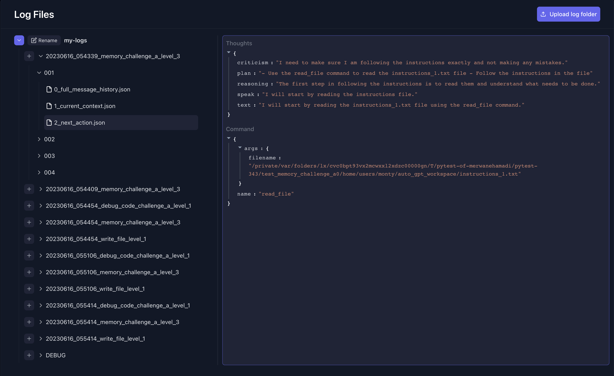

# Dashboard

The Auto‑GPT dashboard provides a live view of issue events emitted on the
shared message queue. It is useful for tracking the orchestrated issue lifecycle.

## Setup

Install dependencies and start the web server:

```bash
python -m autogpt.dashboard.app
```

The server listens on `http://localhost:8000/` by default.

## Configuration

- **Authentication** – Set the environment variable `DASHBOARD_TOKEN` to require
  a matching token as a query parameter or `X-Dashboard-Token` header.
- **Message queue** – The dashboard subscribes to the same `MessageQueue` used by
  the agents.

## Screenshots


