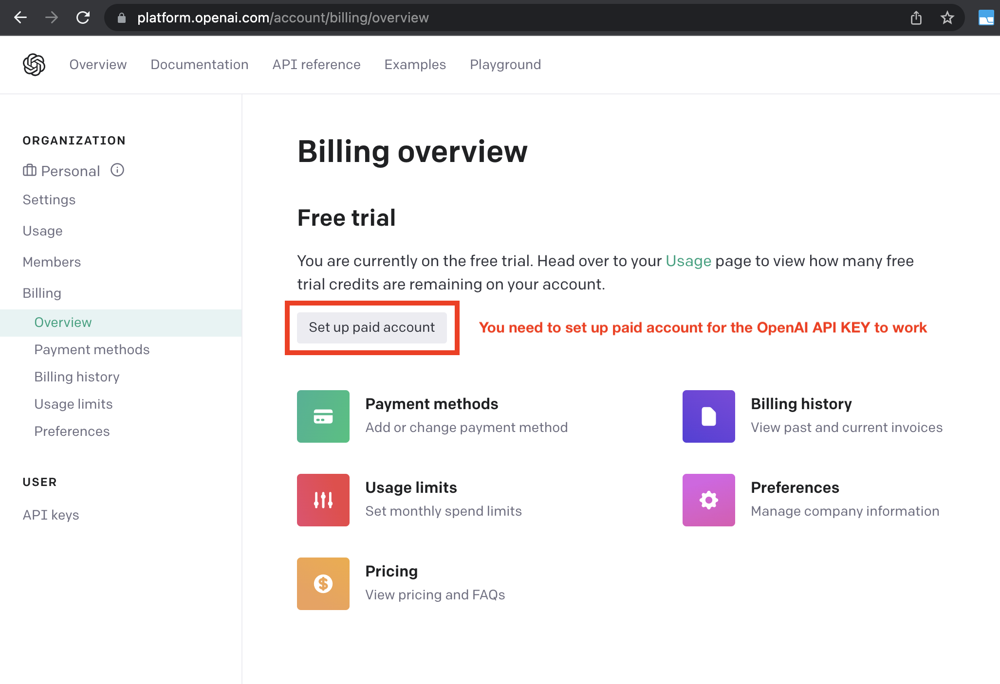

# Setting up Auto-GPT

## 📋 Requirements

Auto-GPT runs on your local machine. You'll need:

  - Python 3.10 or later (instructions: [for Windows](https://www.tutorialspoint.com/how-to-install-python-in-windows))
  - [Git](https://git-scm.com/downloads) (optional, but recommended)


## 🗝️ Getting an API key

Get your OpenAI API key from: [https://platform.openai.com/account/api-keys](https://platform.openai.com/account/api-keys).

!!! attention
    To use the OpenAI API with Auto-GPT, we strongly recommend **setting up billing**
    (AKA paid account). Free accounts are [limited][openai/api limits] to 3 API calls per
    minute, which can cause the application to crash.

    You can set up a paid account at [Manage account > Billing > Overview](https://platform.openai.com/account/billing/overview).

[openai/api limits]: https://platform.openai.com/docs/guides/rate-limits/overview#:~:text=Free%20trial%20users,RPM%0A40%2C000%20TPM

!!! important
    It's highly recommended that you keep track of your API costs on [the Usage page](https://platform.openai.com/account/usage).
    You can also set limits on how much you spend on [the Usage limits page](https://platform.openai.com/account/billing/limits).




### Using a local model server

To point Auto-GPT to a locally served model, set `OPENAI_API_BASE_URL` to your
server's endpoint, e.g. `http://localhost:8000/v1`. Update `SMART_LLM`,
`FAST_LLM`, and `EMBEDDING_MODEL` to match the model names your server
provides. If the server does not require authentication, any placeholder value
for `OPENAI_API_KEY` will suffice.

## Setting up Auto-GPT

### Set up with Git

!!! important
    Make sure you have [Git](https://git-scm.com/downloads) installed for your OS.

!!! info "Executing commands"
    To execute the given commands, open a CMD, Bash, or Powershell window.  
    On Windows: press ++win+x++ and pick *Terminal*, or ++win+r++ and enter `cmd`

1. Clone the repository

    ```shell
    git clone https://github.com/Significant-Gravitas/Auto-GPT.git
    ```

2. Navigate to the directory where you downloaded the repository

    ```shell
    cd Auto-GPT
    ```

### Set up from release archive

1. Download `Source code (zip)` from the [latest release](https://github.com/Significant-Gravitas/Auto-GPT/releases/latest)
2. Extract the zip-file into a folder


### Configuration

1. When you create a workspace, Auto-GPT automatically copies `.env.template` to `.env` and creates `ai_settings.yaml` and `prompt_settings.yaml` if they do not exist. These files can be edited to configure the agent.
2. Open the `.env` file in a text editor.
3. Find the line that says `OPENAI_API_KEY=`.
4. After the `=`, enter your unique OpenAI API Key *without any quotes or spaces*.
5. Enter any other API keys or tokens for services you would like to use.

    !!! note
        To activate and adjust a setting, remove the `# ` prefix.

6. Save and close the `.env` file.

!!! info "Using a GPT Azure-instance"
    If you want to use GPT on an Azure instance, set `USE_AZURE` to `True` and
    make an Azure configuration file:

    - Rename `azure.yaml.template` to `azure.yaml` and provide the relevant `azure_api_base`, `azure_api_version` and all the deployment IDs for the relevant models in the `azure_model_map` section:
        - `fast_llm_deployment_id`: your gpt-3.5-turbo or gpt-4 deployment ID
        - `smart_llm_deployment_id`: your gpt-4 deployment ID
        - `embedding_model_deployment_id`: your text-embedding-ada-002 v2 deployment ID

    Example:

    ```yaml
    # Please specify all of these values as double-quoted strings
    # Replace string in angled brackets (<>) to your own deployment Name
    azure_model_map:
        fast_llm_deployment_id: "<auto-gpt-deployment>"
        ...
    ```

    Details can be found in the [openai-python docs], and in the [Azure OpenAI docs] for the embedding model.
    If you're on Windows you may need to install an [MSVC library](https://learn.microsoft.com/en-us/cpp/windows/latest-supported-vc-redist?view=msvc-170).

[show hidden files/Windows]: https://support.microsoft.com/en-us/windows/view-hidden-files-and-folders-in-windows-97fbc472-c603-9d90-91d0-1166d1d9f4b5
[show hidden files/macOS]: https://www.pcmag.com/how-to/how-to-access-your-macs-hidden-files
[openai-python docs]: https://github.com/openai/openai-python#microsoft-azure-endpoints
[Azure OpenAI docs]: https://learn.microsoft.com/en-us/azure/cognitive-services/openai/tutorials/embeddings?tabs=command-line


## Running Auto-GPT

### Run locally

#### Create a virtual environment

Create and activate a virtual environment:

```shell
python -m venv venvAutoGPT
source venvAutoGPT/bin/activate
pip3 install --upgrade pip
```

#### Install Auto-GPT

From the project directory, install Auto-GPT and its dependencies:

```shell
pip install -e .
```

#### Start Auto-GPT

Run the command-line tool in your terminal:

```shell
agpt
```

If this gives errors, make sure you have a compatible Python version installed.
See also the [requirements](./installation.md#requirements).
