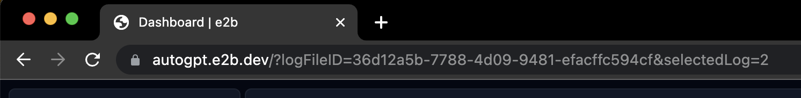
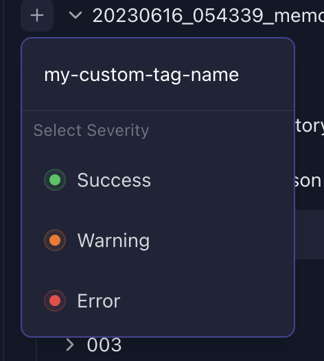

## 与我们分享日志以帮助改进 Auto-GPT

你是否注意到代理出现奇怪行为？是否有有趣的用例？是否有想报告的 bug？按照以下步骤启用日志并上传。在提交问题报告或与我们讨论问题时，你可以附上这些日志。

### 启用调试日志
活动、错误和调试日志位于 `./logs`

打印调试日志：

```shell
agpt --debug
```

### 检查并分享日志
你可以通过 [e2b](https://e2b.dev) 检查和分享日志。


1. 访问 [autogpt.e2b.dev](https://autogpt.e2b.dev) 并登录。
2. 你会看到 AutoGPT 团队其他成员的日志，可供检查。
3. 或者上传你自己的日志。点击“Upload log folder”按钮并选择你生成的调试日志目录。等待 1-2 秒，页面会重新加载。
4. 你可以通过分享浏览器中的 URL 来分享日志。


### 为日志添加标签
你可以为日志添加自定义标签供团队其他成员使用。如果你想指示代理例如在挑战任务中遇到问题，这会很有用。

E2b 提供 3 种严重程度：

- Success（成功）
- Warning（警告）
- Error（错误）

你可以按任何方式命名你的标签。

#### 如何添加标签
1. 点击日志文件夹名称左侧的“plus”按钮。


2. 输入新标签的名称。

3. 选择严重程度。


