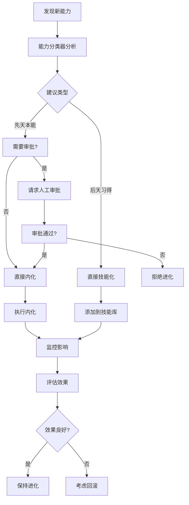

# 能力归属决策框架 (Ability Classification Framework)

## 概述

能力归属决策框架是一个基于四大决策原则的智能系统，帮助AI系统决定新发现的能力应该：

1. **内化为"先天本能"** (Innate Ability) - 修改代理核心代码
2. **掌握为"后天习得"** (Acquired Skill) - 放入技能库

这个框架解决了AI系统在能力管理中的核心问题：如何在效率、风险、可维护性和进化潜力之间找到最佳平衡。

## 设计理念

### 哲学基础

这个框架基于一个深刻的洞察：**AI系统的能力管理应该模仿人类的学习方式**。

- **先天本能**：就像呼吸、心跳一样，是系统"与生俱来"的能力
- **后天习得**：就像使用工具、驾驶汽车一样，是系统"学会"的技能

### 核心问题

当系统发现一个新的解决方案时，必须回答：
> "这个能力应该成为'我'的一部分，还是应该成为'我'可以使用的工具？"

这是一个关于效率、风险、可维护性和进化潜力的复杂权衡。

## 四大决策原则

### 原则一：普适性 (Universality)

**问题**：这个新能力是否是所有或绝大多数任务在底层都需要用到的基础能力？

**决策标准**：
- **内化条件**：高度普适，所有任务都需要
- **技能化条件**：领域相关，特定场景使用

**示例**：
- ✅ 内化：内存优化器、成本分析器
- ❌ 技能化：网页抓取器、邮件发送器

### 原则二：调用频率与开销 (Frequency & Overhead)

**问题**：在一个典型的任务流程中，这个能力被调用的频率有多高？

**决策标准**：
- **内化条件**：每个思考步骤都调用，高频调用
- **技能化条件**：任务流程中只调用几次

**示例**：
- ✅ 内化：推理引擎、决策验证器
- ❌ 技能化：文件处理器、图表生成器

### 原则三：抽象层次 (Level of Abstraction)

**问题**：这个新能力是改变了代理"如何做事"还是"如何思考"？

**决策标准**：
- **内化条件**：元认知、战略规划、学习方法论
- **技能化条件**：具体的功能性动作

**示例**：
- ✅ 内化：战略规划器、任务分解器
- ❌ 技能化：文件读写器、API调用器

### 原则四：稳定与风险 (Stability & Risk)

**问题**：这个新能力是否已经完全成熟、稳定？

**决策标准**：
- **内化条件**：经过千锤百炼、绝对稳定可靠
- **技能化条件**：实验性、需要频繁迭代

**示例**：
- ✅ 内化：生产级推理引擎
- ❌ 技能化：实验性网页抓取器

## 技术实现

### 架构组件

```
┌─────────────────────────────────────────────────────────────┐
│                    能力归属决策框架                          │
├─────────────────────────────────────────────────────────────┤
│  ┌─────────────┐  ┌─────────────┐  ┌─────────────┐        │
│  │  能力分类器  │  │  进化管理器  │  │  审批门     │        │
│  │Classifier   │  │Evolver      │  │ApprovalGate │        │
│  └─────────────┘  └─────────────┘  └─────────────┘        │
├─────────────────────────────────────────────────────────────┤
│  ┌─────────────┐  ┌─────────────┐  ┌─────────────┐        │
│  │  普适性分析  │  │  频率分析   │  │  抽象分析   │        │
│  │Universality │  │Frequency    │  │Abstraction  │        │
│  └─────────────┘  └─────────────┘  └─────────────┘        │
├─────────────────────────────────────────────────────────────┤
│  ┌─────────────┐  ┌─────────────┐  ┌─────────────┐        │
│  │  稳定性分析  │  │  综合决策   │  │  影响评估   │        │
│  │Stability    │  │Decision     │  │Impact       │        │
│  └─────────────┘  └─────────────┘  └─────────────┘        │
└─────────────────────────────────────────────────────────────┘
```

### 核心类

#### AbilityClassifier
```python
class AbilityClassifier:
    """能力分类器 - 核心决策引擎"""
    
    def analyze_ability(self, ability_name: str, description: str, 
                       metadata: Dict[str, Any]) -> AbilityAnalysis:
        """分析能力并做出归属决策"""
        
    def _analyze_universality(self, description: str, metadata: Dict[str, Any]) -> Tuple[UniversalityLevel, float]:
        """分析普适性"""
        
    def _analyze_frequency(self, description: str, metadata: Dict[str, Any]) -> Tuple[FrequencyLevel, float]:
        """分析调用频率"""
        
    def _analyze_abstraction(self, description: str, metadata: Dict[str, Any]) -> Tuple[AbstractionLevel, float]:
        """分析抽象层次"""
        
    def _analyze_stability(self, description: str, metadata: Dict[str, Any]) -> Tuple[StabilityLevel, float]:
        """分析稳定性"""
        
    def _make_decision(self, universality_score: float, frequency_score: float,
                      abstraction_score: float, stability_score: float) -> Tuple[AbilityType, float, str]:
        """综合决策"""
```

#### AbilityEvolver
```python
class AbilityEvolver:
    """能力进化管理器 - 执行进化流程"""
    
    def _evolve_to_innate(self, record: EvolutionRecord) -> bool:
        """将能力内化为先天本能"""
        
    def _evolve_to_acquired(self, record: EvolutionRecord) -> bool:
        """将能力进化为后天习得"""
        
    def _request_evolution_approval(self, record: EvolutionRecord):
        """请求进化审批"""
```

### 决策流程



## 使用方法

### 基本使用

```python
from dual_ring_ai.meta.ability_classifier import AbilityClassifier

# 创建分类器
classifier = AbilityClassifier()

# 分析能力
analysis = classifier.analyze_ability(
    ability_name="memory_optimizer",
    description="Optimize memory usage and reduce token costs",
    metadata={
        "version": "2.1.0",
        "maturity": "stable",
        "test_coverage": 95.0,
        "usage_count": 1500
    }
)

print(f"建议类型: {analysis.recommended_type.value}")
print(f"置信度: {analysis.confidence:.2f}")
print(f"决策理由: {analysis.reasoning}")
```

### 集成到创世纪系统

```python
from dual_ring_ai.genesis.ability_evolver import AbilityEvolver
from dual_ring_ai.core.event_bus import EventBus
from dual_ring_ai.core.librarian import Librarian

# 初始化组件
event_bus = EventBus()
librarian = Librarian()
evolver = AbilityEvolver(event_bus, librarian)

# 启动进化管理器
evolver.start()

# 发布能力发现事件
event_bus.publish(
    "ability_discovered",
    {
        "name": "new_ability",
        "description": "A new discovered ability",
        "metadata": {...}
    }
)
```

### 自定义配置

```yaml
# configs/ability_classifier_config.yaml
thresholds:
  universal_threshold: 0.8
  innate_confidence_threshold: 0.8
  
evolution:
  enable_auto_evolution: true
  require_human_approval: true
  max_evolution_per_day: 10
```

## 配置选项

### 决策阈值

| 参数 | 默认值 | 说明 |
|------|--------|------|
| `universal_threshold` | 0.8 | 高度普适的阈值 |
| `every_step_threshold` | 0.9 | 每步调用的阈值 |
| `metacognitive_threshold` | 0.8 | 元认知层次的阈值 |
| `proven_stable_threshold` | 0.9 | 高度稳定的阈值 |
| `innate_confidence_threshold` | 0.8 | 内化决策的置信度阈值 |

### 进化设置

| 参数 | 默认值 | 说明 |
|------|--------|------|
| `enable_auto_evolution` | true | 是否启用自动进化 |
| `require_human_approval` | true | 是否需要人工审批 |
| `max_evolution_per_day` | 10 | 每日最大进化次数 |
| `monitor_evolution_impact` | true | 是否监控进化影响 |
| `enable_rollback` | true | 是否启用回滚 |

## 监控和统计

### 分析统计

```python
stats = classifier.get_statistics()
print(f"总分析数: {stats['total_analyses']}")
print(f"建议内化: {stats['innate_recommendations']}")
print(f"建议技能化: {stats['acquired_recommendations']}")
print(f"平均置信度: {stats['average_confidence']:.2f}")
```

### 进化统计

```python
evolution_stats = evolver.get_evolution_statistics()
print(f"总进化数: {evolution_stats['total_evolutions']}")
print(f"成功率: {evolution_stats['success_rate']:.1f}%")
print(f"平均置信度: {evolution_stats['average_confidence']:.2f}")
```

## 最佳实践

### 1. 保守策略
- 默认路径：一切皆为技能
- 只有同时满足四个严苛条件时才考虑内化
- 高风险的内化操作必须人工审批

### 2. 渐进式进化
- 先作为技能使用和测试
- 收集使用数据和效果反馈
- 只有在充分验证后才考虑内化

### 3. 持续监控
- 监控进化后的系统表现
- 评估影响和副作用
- 及时回滚失败的进化

### 4. 文档化
- 记录每个进化的决策过程
- 保存分析结果和决策理由
- 建立进化历史档案

## 风险控制

### 内化风险
- **高风险**：修改代理核心代码
- **影响深远**：可能影响整个系统
- **难以逆转**：回滚成本很高

### 控制措施
1. **人工审批**：所有内化操作需要人工审批
2. **分阶段实施**：先在测试环境验证
3. **监控机制**：实时监控系统表现
4. **回滚机制**：支持快速回滚

## 未来扩展

### 1. 机器学习优化
- 基于历史数据训练决策模型
- 自动优化决策阈值
- 预测进化成功率

### 2. 多维度评估
- 性能影响评估
- 安全性评估
- 兼容性评估

### 3. 分布式进化
- 支持多代理协同进化
- 进化知识共享
- 全局最优策略

## 总结

能力归属决策框架为AI系统的能力管理提供了一个清晰、安全、可解释的决策路径。它确保了系统在不断进化的同时，始终保持稳定和可控。

**核心价值**：
- 🎯 **客观决策**：基于明确的四大原则
- 🔒 **安全可控**：高风险操作需要审批
- 📊 **可监控**：完整的统计和监控机制
- 🔄 **可回滚**：支持失败进化的回滚
- 📈 **持续优化**：基于反馈的持续改进

这个框架为AI系统的自我成长提供了一条清晰而安全的道路，确保了它在不断变强的同时，其核心始终保持稳定和可控。
